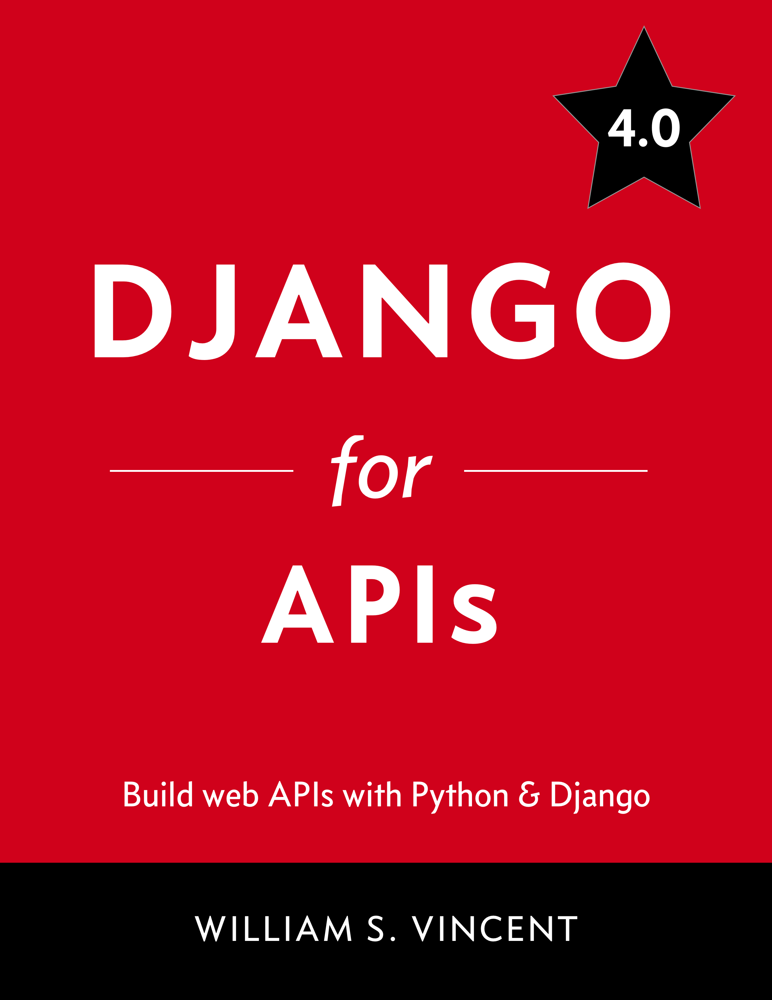

# {{ $frontmatter.title }}

I love Django! I've always had an interest in Python ever since I started my coding journey. It was my first language that I learnt using [Codecademy](https://www.codecademy.com/) when I was in high school.
These days my job involves a lot more frontend work than backend but with all of my hobby projects, Django is always a go to.

There are lots of Python frameworks out there including Flask and Pyramid but if you're like me you can appreciate the batteries included approach of Django. You know that you have all the tools you need in one place without needing to install anything else. There's also a process and best practice for pretty much any task you need to complete.

Plus the [docs](https://docs.djangoproject.com/) are great and explain everything you need to know including more advanced topics!
A lot of developers these days look to YouTube to learn topics like Django however, I have always been a big fan of books and online written tutorials. For me, I like the structure and organisation.

With that in mind, keep reading to see a list of the best Django books available in 2024 in my humble opinion. I'll rank them in my favourite order and give a brief description of each one.

## The Best Django Books for Beginners

This first list of books is specifically aimed at developers that are just starting to learn Django. The focus will be on learning the key concepts of Django through code examples, included source code and project-based introductions to the framework. Whether you have programming experience or not, start with one or two of the following books:

### Django for Beginners

By William S. Vincent

If you're just starting out learning Django, this book is an absolute goldmine! It's an excellent book and I highly recommend it. The author is very knowledgeable. He covers a wide range of topics and modern, industry-standard web development techniques.

Inside the book you'll learn everything from setting up an initial development environment, using databases, project structure and class-based views to deployment, security, custom user models authorisation, user authentication and permissions.

The other great thing that I love about this book is that throughout you will learn by building out real production websites and applications to go in your portfolio. Each chapter builds on the previous as you gain more and more knowledge through practical examples and code snippets that are explained thoroughly by William S Vincent.

This is my favourite Django book and an excellent resource for complete beginners or professional developers learning Django. I still use it to this day for referencing things like setting up my projects and deploying them. It's also recently been updated for Django 5.

Here's a link to [Buy on Amazon](https://www.amazon.com/dp/1735467243/). If you want a sneak peek, you can also [read a sample for free](https://djangoforbeginners.com/introduction/) on the author's website.

### A Wedge of Django

By Daniel Roy Greenfeld & Audrey Feldroy

A wedge of Django is also a learning resource aimed at beginners. It’s written by the same authors that created Two Scoops of Django which we’ll talk about later in the article. For now just know that Two Scoops of Django is basically the Django Bible for a lot of developers.

Moving on from that, inside a wedge of Django, you’ll find a beginner friendly walkthrough of building a modern web application from the ground up using Python and Django.

Here’s a link to [buy the book](https://www.feldroy.com/two-scoops-press) from the author‘s website.

## The Best Django Books for Intermediate Developers

These next few books are aimed at intermediate developers and Django enthusiasts.

Once you have the basic concepts down and have come to the realisation that Django is in fact the best web framework out there, I recommend taking a read through the books below to take your knowledge to the next level and start building more complex applications with advanced features.

Without further or do:

### Django for Professionals

By William S. Vincent

This is 100%, without a doubt, my favourite Django book. Similar to the Django for beginners book, it walks you through building out web applications using Python and Django whilst building your knowledge up and introducing new topics in each chapter.

When I was learning to code I always struggled bridging the gap between building 'hello world' or 'todo list' applications and then large, complex apps that people use on a daily basis. This book teaches exactly that and it finally made it click for me!

Building on from your knowledge in the first book, the author teaches you Docker, search bars in Django, file and image uploads, performance, advanced security, in depth testing, advanced user registration, class-based views, PostgreSQL and much more.

Here's a link to [Buy on Amazon](https://www.amazon.com/Django-Professionals-Production-websites-Python/dp/1735467235/). If you want a sneak peek, you can also [read a sample for free](https://djangoforprofessionals.com/introduction/) on the author's website. William also offers a discount if you want to buy all 3 of his excellent books.

### Two Scoops of Django

By Daniel Feldroy & Audrey Feldroy

Two Scoops of Django is a bit different from your regular Django books but, in a good way!
A lot of Django developers consider this book like the Bible for Django.

Rather than walking you through building an app in a tutorial like fashion, Two Scoops has a chapter for each important area of Django and is a great reference for best practices, top tips and explanations into why to do things a specific way.

Some of the chapters in the book are models, views, templates, project structure, database queries, the admin, testing, deployment, performance and so much more!

It really is a great guide if you are going to be developing productions apps with Django.
Here's where you can [buy the book](https://www.feldroy.com/two-scoops-press#two-scoops-of-django)!

### Django for APIs

By William S. Vincent

You know how much I love William's books and again I will always recommend this one. As it says on the tin, this book teaches you how to build web APIs with Python & Django.

Whereas the other two books by the same author are great at teaching Django as a whole and building real life applications, this book is more specialised.

APIs are a massive part of web development and the same goes for frontend frameworks like React, Vue, Angular, Svelte and the other hundreds that exist. If you're planning to use Django as a backend API for your frontend or even mobile apps, this book is an excellent recommendation. You'll learn everything you need to know about building modern APIs with Django and the Django REST Framework. It doesn't matter where you're never heard of an API or you're an experienced developer wanting to try your hand at Django.
As always, topics include: testing, deployment, building APIs from scratch, user authentication, permissions, documentation, viewsets, routers and so much more!

Here's a link to [Buy on Amazon](https://www.amazon.com/Django-APIs-Build-web-Python/dp/1735467227/). If you want a sneak peek, you can also [read a sample for free](https://djangoforapis.com/introduction/) on the author's website. William also offers a discount if you want to buy all 3 of his excellent books.

## Other Resources to Learn Django

If you're serious about learning Django to build web applications, the books above are great. However in addition to those here's some other great resources to learn Django and supplement your learning. Not to mention some of these are also free! Personally I started with the official Django tutorial and then moved on to the slightly more advanced tutorial by Mozilla. I've also done the course on Codecademy which is more beginner friendly and is excellent.

- [Learn Django Tutorial by Mozilla](https://developer.mozilla.org/en-US/docs/Learn/Server-side/Django)
- [Official Django Introduction](https://docs.djangoproject.com/intro)
- [Build Python Web Apps with Django - Codecademy](https://www.codecademy.com/learn/paths/build-python-web-apps-with-django)

## More Django Posts

Check out my [full list of Django posts](../django/).
